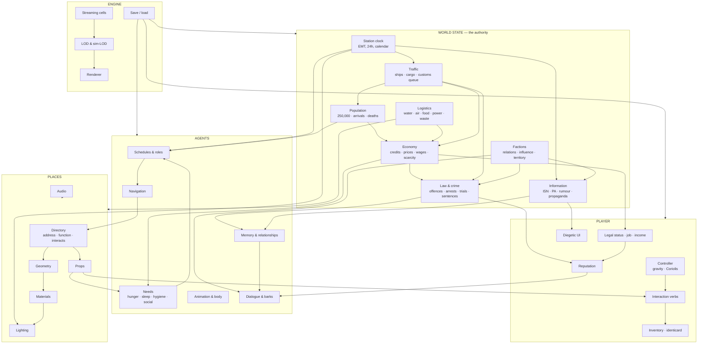

# MASTER PLAN — Babylon 5, 1:1, living

**Status:** authoritative. Supersedes the phase plan and extends the layer plan in `CLAUDE.md`.
**Written:** session 3k, after an audit of the layer plan found it structurally incomplete.

---

## 0. The deliverable, stated so it can be checked

> A 1:1-scale, canon-accurate, real-time simulation of Babylon 5 in which the player is **one of
> 250,000 inhabitants** of a station that continues to run whether or not they are watching.
> Every location from the show, in the right place. AAA quality in every dimension.

Four properties, and each has to be independently true:

| | Property | Fails if |
|---|---|---|
| **A** | **It is Babylon 5** | A viewer who knows the show catches an error of place, proportion, colour or era |
| **B** | **It is beautiful** | A frame does not clear `docs/AAA-STANDARD.md` on craft |
| **C** | **It is alive** | The station behaves identically whether or not it is observed; leaving and returning is consistent; 03:00 differs visibly from 13:00 |
| **D** | **It is inhabitable** | The player has a role, needs, and things to do that arise from the simulation rather than from a quest list |

**The current plan delivers A and B and does not deliver C or D.** That is the audit's central
finding and the reason this document exists.

---

## 1. AUDIT of the eight-layer plan

The layer plan (`CLAUDE.md`) is: addressed → geometry → materials → lighting → props → inhabitants
→ audio → judged, across all 126 locations, completed in order.

### 1.1 What it gets right — keep all of this

- **Layers over slices.** Correct, and correct for the specific reason the owner gave: a completed
  layer is a state the next context inherits. This project loses context regularly.
- **A computed denominator.** `directory.py` parses the gazetteer and prints completion. Progress
  is a number the repository calculates.
- **Contiguous layer reporting.** A place with audio but no materials is at layer 2, not 7.
- **Layer 0 blocking.** Craft cannot be judged from the flat-shaded rasteriser, so the engine path
  must precede the craft layers.

### 1.2 FINDING 1 — the layers describe a *set of places*, not a *simulation*

**Severity: blocking.** Every one of the eight layers is a property of a location. Run all eight to
completion and you get 126 beautiful, correctly-placed, lit, propped, populated, scored rooms —
**and a dead station.**

"Living and breathing" is not a property of a location. It is a property of *systems that run
across locations*: an economy, a legal system, a news cycle, a population that changes, needs that
create motive, consequences that persist. None of those appear anywhere in the plan.

The NPC modules make this concrete. `schedule.py` knows a Narn dockworker's shift. Nothing makes
them **hungry**, nothing **pays** them, nothing **notices** if they never arrive, and nothing
**remembers** that they were arrested last week. They execute a timetable. A timetable is not a
life.

**Fix:** a second track — **SYSTEMS** — that runs in parallel and has its own layers and its own
completion metric.

### 1.3 FINDING 2 — there is no player

**Severity: blocking.** Nothing in the plan builds a controller, a camera, an interaction verb, an
inventory, a UI, or a save file. The physics for flight and docking exist; the means to *be
someone* does not.

"You are one of 250,000 inhabitants" implies the player has: an identicard, a legal status,
quarters at some class, an income, a job with a roster, a reputation, and a body subject to the
same gravity gradient as everyone else. That is a design, and it is absent.

**Fix:** a third track — **PLAYER**.

### 1.4 FINDING 3 — layer 5 conflates geometry with behaviour

`props & function` is one layer covering two unrelated kinds of work: *a chair exists* and *a chair
can be sat on, is owned by the bar, wears out, and is thrown in a fight*. The first is modelling;
the second is simulation. Bundling them guarantees the second is skipped, because the layer will
look complete once the meshes are there.

**Fix:** split into **props (geometry)** in the place track and **interaction & behaviour** in the
systems track.

### 1.5 FINDING 4 — nothing verifies the whole

Layer 8 judges each location. Nothing judges **the station**: variety, pacing, memorability,
whether Red feels different from Blue, whether the 24-hour cycle reads, whether a two-hour walk is
worth taking. AAA reviews are written about wholes.

**Fix:** a **holistic judgement** milestone with its own criteria, and a **soak test** — run the
simulation for simulated weeks and assert it has not drifted.

### 1.6 FINDING 5 — Layer 0 has no acceptance criteria

"A materialled, lit frame comes out of Godot" is not a bar. Which frame? Judged how? Recorded
where?

**Fix:** Layer 0 exits when a **named scene** renders in the engine, is scored against all four
rubric dimensions, and the score is committed to `docs/aaa-scorecard.json` — with the score being
allowed to be *bad*. The gate is that the loop works, not that the first frame is good.

### 1.7 FINDING 6 — no performance milestone on real hardware

Budgets are numeric proxies. `CLAUDE.md` is explicit that they say nothing about framerate. There
is no point in the plan where actual framerate is measured, and no owner-machine test.

**Fix:** an explicit **performance milestone** requiring a measurement on target hardware, and an
honest statement that until then all performance claims are proxies.

### 1.8 FINDING 7 — no content-volume strategy

126 locations at hand-authored AAA dressing is, at commercial rates, several hundred person-years.
The plan does not say how one agent covers it.

The answer already exists in the architecture and is not written down: **everything is generated
from data.** The plan must state the ratio explicitly — which locations are hero-authored, which
are procedurally dressed from a kit, and what fraction of the station a player will ever stand in.

**Fix:** a **tiering** rule, in §3.4.

### 1.9 FINDING 8 — the era lock is never verified end to end

S2–3 is asserted per module. Nothing checks the *finished* station for era consistency — a S5
uniform beside a S2 sign is exactly the kind of error that survives a per-module check.

**Fix:** an **era sweep** in the judgement milestone.

### 1.10 Smaller gaps found, each folded into the plan below

- No **save/load**, so nothing persists between sessions of *play*.
- No **localisation or accessibility**, both AAA table stakes.
- No **photo mode**, which is how a beautiful game gets seen.
- No **sound propagation** — layer 7 is ambience only, and occlusion is what makes audio read as
  space.
- No **dialogue or language** system, though the gazetteer establishes fifteen species.
- No **damage, repair or failure** states, though the station is a machine with a plant.
- No **onboarding** — how a player learns an 8 km station.
- **Coriolis and the 2.23× gravity spread are derived and unused.** The most distinctive physical
  fact about this station currently affects nothing a player feels.

---

## 2. SYSTEM ARCHITECTURE — everything, and how it connects

### 2.1 The map



### 2.2 The systems, in full

Every row is a system that must exist. **Status** is honest as of session 3k.

#### World state — the authority nothing may contradict

| # | System | What it does | Feeds | Status |
|---|---|---|---|---|
| W1 | **Station clock** | EMT 24 h cycle (authority 1, customs board), calendar, era date | schedules, lighting, news, traffic | partial — `schedule.py` |
| W2 | **Population register** | 250,000 exactly; species mix; births, deaths, arrivals, departures | economy, schedules, crowd | partial — counts only |
| W3 | **Economy** | Credits, prices, wages, rent, scarcity, the black market | needs, crime, player income | **none** |
| W4 | **Logistics** | Water, air, food, power, waste flows and stocks — `LIFE-SUPPORT-AND-INDUSTRY.md` sized all of them | economy, failures, plant | **none** (researched) |
| W5 | **Traffic & customs** | Ship arrivals/departures, cargo, the queue, refusals — `TRAFFIC-AND-CUSTOMS.md` | population, economy, law | **none** (researched) |
| W6 | **Factions** | 15 species + Nightwatch, relations, influence, territory | dialogue, law, news, crowd mix | partial — `FACTIONS.md` data |
| W7 | **Law & crime** | Offences, detection, arrest, trial, sentence, Downbelow's 90% share | reputation, memory, security NPCs | **none** (researched) |
| W8 | **Information** | ISN broadcasts, PA announcements, rumour spread, propaganda | NPC memory, player UI, screens | **none** |
| W9 | **Damage & repair** | Wear, faults, breakdowns, engineers dispatched, hull breaches | logistics, jobs, drama | **none** |
| W10 | **Events** | Scheduled (Council session) and emergent (bar fight, strike, outbreak) | everything | **none** |

#### Agents

| # | System | What it does | Status |
|---|---|---|---|
| A1 | **Roles & schedules** | Who works where, when; three watches | **done** — `schedule.py` |
| A2 | **Needs** | Hunger, thirst, sleep, hygiene, social, money — the *motive* behind a schedule | **none** |
| A3 | **Memory & relationships** | Who knows whom, who saw what, grudges, favours | **none** |
| A4 | **Navigation** | Pathing across the station | **done** — `navigation.py` |
| A5 | **Bodies & costume** | 15 species, per-individual variation, era-gated dress | **done** |
| A6 | **Animation** | Locomotion, gesture, sit/eat/work, gravity-aware gait | **done** (unwelded joints outstanding) |
| A7 | **Dialogue & barks** | Speech, alien languages, translation, overheard conversation | **none** |
| A8 | **Group behaviour** | Queues, crowds, panic, riots, security cordons | partial — `crowd.py` density only |
| A9 | **Simulation LOD** | Full agent ↔ flow agent ↔ statistical, with consistency across promotion | partial — designed, not enforced |

#### Places — the current eight layers

| # | Layer | Status |
|---|---|---|
| P1 | Addressed | 29/126 |
| P2 | Geometry | 19/126 |
| P3 | Materials | 0 |
| P4 | Lighting | 0 |
| P5 | Props (geometry) | 0 |
| P6 | Inhabitants placed | 0 |
| P7 | Audio | 0 |
| P8 | Judged | 0 |

#### Player

| # | System | Status |
|---|---|---|
| L1 | **Controller** — walk, run, crouch, climb; per-deck gravity; Coriolis on throws and falls | **none** |
| L2 | **Interaction verbs** — the 71 declared prop types must do something | **none** (specified) |
| L3 | **Inventory & identicard** — carrying, the identicard as a legal object | **none** |
| L4 | **Status** — visa, work permit, quarters class, income, rent | **none** |
| L5 | **Reputation** — per faction, per individual | **none** |
| L6 | **Diegetic UI** — Babcom terminals, signage, no floating HUD where avoidable | **none** |
| L7 | **Flight** — Starfury cockpit, HUD, launch and dock as one continuous action | physics **done**, cockpit none |
| L8 | **Transit** — riding lifts, trams, the core shuttle; the 2-minute rim-to-axis ride | physics **done**, riding none |
| L9 | **Save / load** | **none** |
| L10 | **Onboarding** — how a player learns 8 km | **none** |
| L11 | **Accessibility & localisation** | **none** |
| L12 | **Photo mode** | **none** |

#### Presentation & engine

| # | System | Status |
|---|---|---|
| E1 | Renderer path (Godot + lavapipe offscreen) | **exists, unused since 2j — LAYER 0** |
| E2 | Material library → engine | `materials.py` exists, not wired |
| E3 | Lighting rig + volumetrics (B5's signature haze and shafts) | none |
| E4 | Exposure / eye adaptation — mandatory: the bar is near-black, the Garden is bright | none |
| E5 | Reflections, shadows, SSAO | none |
| E6 | VFX — steam, sparks, holograms, engine plumes | none |
| E7 | Screen content — Babcom, ISN, departure boards rendered to texture | none |
| E8 | Decals & wear | none |
| E9 | Streaming | **done** — 3,414 cells |
| E10 | LOD | partial — `lod.py` exterior only |
| E11 | Audio engine — propagation, occlusion, reverb zones | none |
| E12 | Performance on target hardware | **never measured** |

---

## 3. THE REVISED PLAN

### 3.1 Three tracks, not one

```
TRACK P — PLACES     P0 engine path → P1 addressed → P2 geometry → P3 materials
                     → P4 lighting → P5 props → P6 inhabitants → P7 audio → P8 judged

TRACK S — SYSTEMS    S1 clock+population → S2 needs → S3 economy → S4 logistics
                     → S5 traffic → S6 law+crime → S7 information → S8 memory+relationships
                     → S9 events+damage → S10 soak

TRACK L — PLAYER     L1 controller → L2 interaction → L3 status+inventory → L4 UI
                     → L5 transit+flight → L6 save → L7 onboarding → L8 accessibility
```

**Each track completes its layers in order.** Tracks run sequentially by milestone (§3.3), not
simultaneously — the owner's rule stands. Within a milestone, one track is the current one.

### 3.2 Why this ordering

- **P0 first, always.** Nothing about craft can be judged without it.
- **P1–P2 before S.** Systems need places to act on; an economy with no shops is untestable.
- **S1–S3 before P5–P6.** Props and inhabitants should be placed against *what the simulation
  needs*, not guessed. A bar needs a till because the economy has money.
- **L1–L2 early.** The player's reach determines what "interactable" has to mean. Building 71 prop
  behaviours before knowing the verb set is how you build the wrong 71.
- **P8 and S10 last**, together: judge the parts and soak the whole.

### 3.3 Milestones — each is a demonstrable state

| M | Name | Exit criteria | Track |
|---|---|---|---|
| **M0** | **The eye** | A named scene renders in Godot+lavapipe with `materials.py` materials and a lighting rig, is scored on all four rubric dimensions, and the score is committed. **The score may be bad.** | P0 |
| **M1** | **The map** | All 126 locations addressed, non-colliding, adjacency-valid, functions and interactions declared. `directory.py` reports 126/126 at layer 1 | P1 |
| **M2** | **The shell** | All 126 have closed, correctly wound geometry inside their footprints. Boundary-edge count zero station-wide | P2 |
| **M3** | **The look** | Materials and lighting on all 126. Every location scores ≥4 on craft in an engine frame | P3–P4 |
| **M4** | **The pulse** | Clock, population, needs and economy run. An NPC gets hungry, goes to a bar, pays, and the bar's stock falls. Observed and unobserved paths agree | S1–S3 |
| **M5** | **The body** | Player walks the station under correct per-deck gravity, uses the verb set on real props, carries an identicard | L1–L3 |
| **M6** | **The world** | Logistics, traffic, law and information run. A ship arrives, cargo clears customs, a theft is reported, ISN mentions it | S4–S7 |
| **M7** | **The people** | Memory, relationships, dialogue, group behaviour. NPCs recognise the player and each other | S8, A3, A7 |
| **M8** | **The place** | Props, inhabitants and audio complete across 126. The station is populated at real density with working ambience | P5–P7 |
| **M9** | **The life** | Events and damage. Something goes wrong and the station responds | S9 |
| **M10** | **The game** | Save/load, UI, transit, flight, onboarding, accessibility | L4–L8 |
| **M11** | **The verdict** | Per-location judgement complete; holistic pass; era sweep; **performance measured on target hardware**; soak test over 30 simulated days with no drift | P8, S10 |

### 3.4 Content tiering — how one agent covers 126 locations

Stated explicitly because the plan is otherwise arithmetic that does not close.

| Tier | Count | Treatment | Examples |
|---|---|---|---|
| **Hero** | ~12 | Hand-authored to the reference frame, individually judged | Zocalo, C&C, Council Chamber, customs, the Garden landmark, Medlab One |
| **Featured** | ~30 | Kit-built with a hand-authored identity pass — a distinctive fitting, palette and light rig | Dark Star, casino, Security Central, Medlabs, the bar |
| **Generic** | ~84 | Fully procedural from the kit, varied by seed, dressed by function tag | Corridors, quarters runs, storage, offices, plant bays |

**The player will stand in every tier.** The test is that a *generic* location is not identifiably
generic — which is what the kit, the wear system and per-sector palettes are for.

### 3.5 The stopping rule stands

`docs/AAA-STANDARD.md` already defines it: a subsystem is done at **two consecutive clean review
rounds**, with severity ladder and clean-round reset. That applies unchanged to every layer here.

---

## 4. WHAT WE WOULD HAVE MISSED — the lessons other simulations paid for

Not a wish list. Each of these is a specific failure mode with a specific fix in the plan.

### 4.1 The look-away problem — *Dwarf Fortress*, *RimWorld*, *Star Citizen*

The hardest problem in a 250,000-agent simulation is not simulating them. It is that the
statistical layer and the detailed layer must **agree**. Walk away from a shop, come back, and the
stock must be what an hour of trading would have produced.

`schedule.py` has the statistical layer and the design intent. Nothing enforces agreement.
→ **M4 exit criterion: observed and unobserved paths agree**, asserted numerically.

### 4.2 The nemesis problem — *Shadow of Mordor*

What makes a populated world feel authored is that it **remembers**. One NPC who recalls you from
last week is worth a hundred with barks. → **S8 memory & relationships**, and the reputation system.

### 4.3 Needs create motive — *The Sims*, *RimWorld*, *Kenshi*

A schedule tells an NPC where to be. A **need** tells them *why*, and produces behaviour when the
schedule is interrupted — which is when a simulation stops looking like a timetable.
→ **S2 needs**, ahead of props, so props exist to satisfy needs.

### 4.4 The economy is the plot generator — *X4*, *Elite*, *Dwarf Fortress*

Scarcity makes crime, crime makes law, law makes reputation, reputation makes consequences. A
station with no economy has no reason for anything to happen. `LIFE-SUPPORT-AND-INDUSTRY.md`
already computed the flows — 13,250 m³ of water a day, 450 t of food, a >98% closed loop. That is
an economy waiting to be wired. → **S3–S4**.

### 4.5 Environment as antagonist — *Prey*, *Alien: Isolation*, *Barotrauma*

The station is a machine that keeps people alive. If it can never fail, it is scenery. Six
atmospheres, a water loop that must stay closed, 1.9 GW of power, a reactor that can be jettisoned
— every one is a failure mode already researched. → **S9 damage & events**.

### 4.6 Verticality and the felt body — *Half-Life: Alyx*, *Mirror's Edge*

We derived the most distinctive physical facts about this station and used none of them:
**2.23× body weight** between Blue and Grey, **2.00 g** of Coriolis on a fast rim-to-axis transit,
**52.2 m/s** of inherited tangential velocity on launch, and a two-minute lift ride during which
weight drains away. → **L1 controller must implement all four**, and they are gameplay, not trivia.

### 4.7 Diegetic UI — *Dead Space*, *Metro*

This station signs itself: Babcom terminals in every quarters, public monitors, departure boards,
the arrival concourse's station schematic. The UI should be those objects. → **L6**, and **E7**
screen-content rendering.

### 4.8 Audio is half the room — *Alien: Isolation*, *Hunt: Showdown*

Ambience alone is a bed. What makes audio read as *space* is occlusion and propagation: the bar
heard through a door, the plant's compressors felt from Downbelow. → **E11**, not just P7.

### 4.9 Onboarding an 8 km space — *Morrowind*, *Outer Wilds*

126 locations across 8 km with no map screen is hostile. But B5 signs itself, and the arrival
concourse *is* the tutorial — the customs board explains atmospheres, time, currency and the law in
its own voice. → **L7 uses the authority-1 signage as onboarding**, which is both elegant and
canon.

### 4.10 The thing nobody plans for: **what does the player DO?**

"Be one of 250,000" is a premise, not a loop. Without a role the result is a walking simulator with
excellent architecture.

**Proposal, and it needs an owner decision at M5:** the player is a **new arrival with a work
permit**. That single choice activates every system already researched — customs and a visa
(W5), a quarters class and rent (W3), a job with a roster (A1), an income, a reputation, and access
to Downbelow when the money runs out. It is also exactly the show's own entry point for a
newcomer. Everything else — flight, crime, diplomacy — becomes reachable from it rather than
granted.

---

## 5. RISK REGISTER

| Risk | Severity | Mitigation |
|---|---|---|
| **Content volume exceeds one agent's reach** | high | §3.4 tiering; everything generated from data; kit reuse enforced by the directory |
| **Performance never measured on real hardware** | high | M11 requires it; until then all claims are declared proxies |
| **The engine path rots again** | high | It already did — built in 2j, unused by 3k. M0 wires it into CI, not into a session |
| **Systems built against imagined places** | medium | S track ordered after P1–P2 |
| **Canon drift as extrapolation accumulates** | medium | `INVENTIONS.md`, era sweep at M11, authority marked per row |
| **Assertions that cannot fail** | medium | `tools/mutation_sweep.py`; current project-wide coverage **21%** and must rise |
| **Context loss between sessions** | high | `STATE.md`, computed layer counts, this document |
| **Scope creep into a game engine rewrite** | medium | Godot is chosen (ADR 0001); no engine work beyond wiring |

---

## 6. HOW PROGRESS IS TRACKED

1. **`station/directory.py` computes and prints layer completion in CI.** No summary is
   authoritative over it.
2. **Every system in §2.2 gets a status field** in the same register once its track opens, so the
   S and L tracks are counted the same way as P.
3. **`docs/aaa-scorecard.json`** holds per-subsystem rubric scores. A location is at P8 only when
   it has a committed passing score.
4. **`STATE.md`** carries the current milestone and the current layer, and nothing else claims to.

---

## 7. IMMEDIATE NEXT ACTIONS

1. **M0 — the eye.** Wire `materials.py` into the Godot project, build a lighting rig, render the
   Zocalo offscreen through lavapipe, score it against all four dimensions, commit the score.
   *Accept a bad score.* The gate is that the loop closes.
2. **M1 — the map.** Address the remaining 97 locations.
3. **M2 — the shell.** Geometry for all 126.

Then M3 onward in order.
